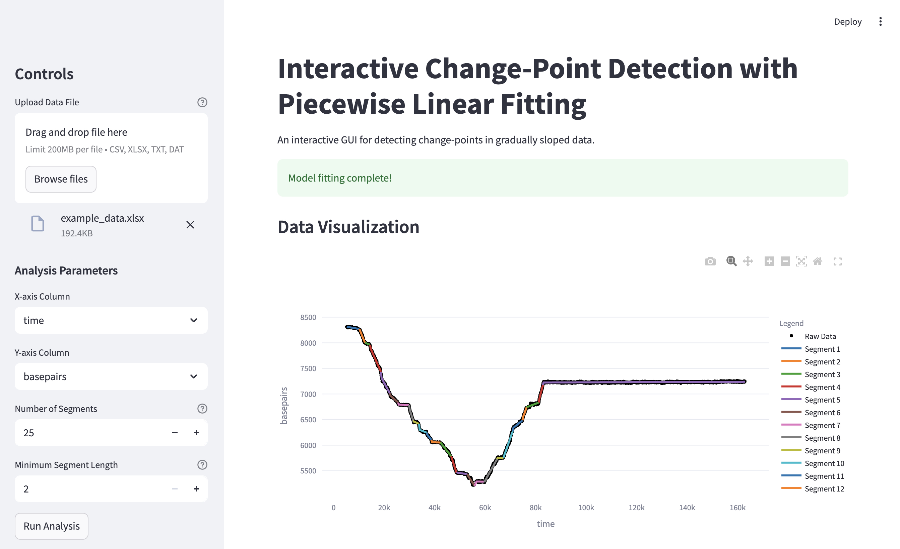

# Interactive Change-Point Detection with Piecewise Linear Fitting

This project provides an interactive web application for detecting change-points in time-series or sequential data. It uses a fast piecewise linear fitting (PWLF) algorithm to identify distinct linear segments in the data, making it useful for analyzing data with changing slopes.



## Key Features

- **Easy Data Upload**: Upload your data in `CSV`, `TXT`, `DAT`, or `XLSX` format.
- **Interactive Visualization**: The data and the resulting fit are plotted using Plotly, allowing you to zoom, pan, and inspect data points.
- **Customizable Analysis**:
    - Select any two columns from your data for X and Y axes.
    - Tune the number of linear segments for the model.
    - Set a minimum number of data points for each segment.
- **Detailed Results**: View a comprehensive table of statistics for each fitted segment, including slope, intercept, R², and more.
- **Export Functionality**: Download the final segment analysis as a CSV file for further use.


## Installation and Setup

To run this application on your local machine, please follow these steps.

### Prerequisites

- [Python 3.8+](https://www.python.org/downloads/) installed on your system.
- `pip` (Python's package installer), which typically comes with Python.

### Step-by-Step Guide

1.  **Clone or Download the Repository**

    If you are using Git, clone the repository to your local machine:
    ```bash
    git clone <repository-url>
    cd shDAM/fast_pwl_fit
    ```
    If you downloaded it as a ZIP file, unzip it and navigate into the `fast_pwl_fit` directory using your terminal.

2.  **Create a Virtual Environment (Recommended)**

    It is best practice to create a separate virtual environment for the project to manage dependencies without affecting other Python projects.

    - **On macOS and Linux:**
      ```bash
      python3 -m venv venv
      source venv/bin/activate
      ```
    - **On Windows:**
      ```bash
      python -m venv venv
      .\venv\Scripts\activate
      ```
    Your terminal prompt should now be prefixed with `(venv)`.

3.  **Install Required Packages**

    With the virtual environment activated, install all the necessary libraries from the `requirements.txt` file:
    ```bash
    pip install -r requirements.txt
    ```

## Running the Application

Once the setup is complete, you can launch the Streamlit application by running the following command from within the `fast_pwl_fit` directory:

```bash
streamlit run app.py
```

The application will automatically open in a new tab in your default web browser.

## How to Use the GUI

1.  **Upload Your Data File**: Use the "Drag and drop file here" widget in the left-hand sidebar to upload your data.
2.  **Select Data Columns**: Once the file is loaded, dropdown menus for "X-axis Column" and "Y-axis Column" will appear. Select the columns you wish to analyze. The plot will update to show a scatter plot of your raw data.
3.  **Configure Parameters**:
    - **Number of Segments**: Choose how many straight lines you want to fit to your data. A higher number will follow the data more closely but might "overfit" and identify noise as a change-point.
    - **Minimum Segment Length**: This sets the smallest number of data points that can constitute a line segment, which helps prevent fitting on very small fluctuations.
4.  **Run Analysis**: Click the "Run Analysis" button. The application will perform the piecewise fit and display the result as a yellow line on the plot.
5.  **Review and Download Results**: Below the plot, a table will appear with detailed statistics for each segment. You can use the "Download results as CSV" button to save this table to your computer.

## Contributing
We welcome contributions to enhance and expand this project. Please fork the repository, make your changes, and submit a pull request. For contribution you can also contact Longfu Xu or Prof. Gijs Wuite.

## Support and Contact
Please note that the code in this repository is custom written for internal lab use and still may contain bugs. For questions, support, or feedback, please contact Dr. Longfu Xu at longfu2.xu[at]gmail.com.

## Citation
When using this software for your research, please cite:

Xu, L., Halma, M.T.J. & Wuite, G.J.L. Mapping fast DNA polymerase exchange during replication. Nature Communications 15, 5328 (2024). https://doi.org/10.1038/s41467-024-49612-3

And the original method:

```bibtex
@Manual{pwlf,
author = {Jekel, Charles F. and Venter, Gerhard},
title = {{pwlf:} A Python Library for Fitting 1D Continuous Piecewise Linear Functions},
year = {2019},
url = {https://github.com/cjekel/piecewise_linear_fit_py}
}
```

## License
This project is licensed under the MPL-2.0 License. See the LICENSE file for more details.

## About
All codes listed in this repository are developed by Dr. Longfu Xu (longfuxu.com) during his PhD work in the Gijs Wuite Lab.